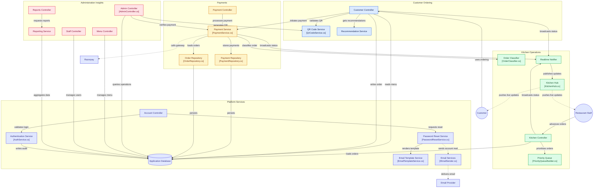

# QServe Architecture Diagram

```mermaid
flowchart TD

subgraph group_customer["Customer Ordering"]
  node_customer_controller["Customer Controller"]
  node_qr_service["QR Code Service<br/>[QrCodeService.cs]"]
  node_recommendation_service["Recommendation Service"]
end

subgraph group_payments["Payments"]
  node_payment_controller["Payment Controller"]
  node_payment_service["Payment Service<br/>[PaymentService.cs]"]
  node_payment_repository["Payment Repository<br/>[PaymentRepository.cs]"]
  node_order_repository["Order Repository<br/>[OrderRepository.cs]"]
end

subgraph group_kitchen["Kitchen Operations"]
  node_kitchen_controller["Kitchen Controller"]
  node_classifier["Order Classifier<br/>[OrderClassifier.cs]"]
  node_priority_queue["Priority Queue<br/>[PriorityQueueBuilder.cs]"]
  node_realtime_notifier["Realtime Notifier"]
  node_kitchen_hub["Kitchen Hub<br/>[KitchenHub.cs]"]
end

subgraph group_admin["Administration Insights"]
  node_admin_controller["Admin Controller<br/>[AdminController.cs]"]
  node_menu_controller["Menu Controller"]
  node_staff_controller["Staff Controller"]
  node_reporting_service["Reporting Service"]
  node_reports_controller["Reports Controller"]
end

subgraph group_platform["Platform Services"]
  node_app_db[("Application Database")]
  node_auth_controller["Account Controller"]
  node_auth_service["Authentication Service<br/>[AuthService.cs]"]
  node_password_reset_service["Password Reset Service<br/>[PasswordResetService.cs]"]
  node_email_template_service["Email Template Service<br/>[EmailTemplateService.cs]"]
  node_email_service["Email Services<br/>[IEmailSender.cs]"]
end

node_customer_actor(("Customer"))
node_staff_actor(("Restaurant Staff"))
node_razorpay["Razorpay"]
node_email_provider["Email Provider"]

node_customer_actor -->|"uses ordering"| node_customer_controller
node_customer_controller -->|"validates QR"| node_qr_service
node_customer_controller -->|"reads menu"| node_app_db
node_customer_controller -->|"gets recommendations"| node_recommendation_service
node_customer_controller -->|"initiates payment"| node_payment_service
node_customer_controller -->|"writes order"| node_app_db
node_customer_controller -->|"broadcasts status"| node_realtime_notifier
node_payment_controller -->|"processes payment"| node_payment_service
node_payment_service -->|"loads orders"| node_order_repository
node_payment_service -->|"stores payments"| node_payment_repository
node_payment_service -.->|"calls gateway"| node_razorpay
node_payment_service -->|"classifies order"| node_classifier
node_payment_service -->|"broadcasts status"| node_realtime_notifier
node_payment_repository -->|"persists"| node_app_db
node_order_repository -->|"persists"| node_app_db
node_admin_controller -->|"queries operations"| node_app_db
node_admin_controller -->|"verifies payment"| node_payment_service
node_admin_controller -->|"generates QR"| node_qr_service
node_menu_controller -->|"manages menu"| node_app_db
node_staff_controller -->|"manages users"| node_app_db
node_reports_controller -->|"requests reports"| node_reporting_service
node_reporting_service -->|"aggregates data"| node_app_db
node_auth_controller -->|"validates login"| node_auth_service
node_auth_service -->|"writes audit"| node_app_db
node_auth_controller -->|"requests reset"| node_password_reset_service
node_password_reset_service -->|"renders template"| node_email_template_service
node_password_reset_service -.->|"sends account mail"| node_email_service
node_email_service -.->|"delivers email"| node_email_provider
node_staff_actor -->|"advances orders"| node_kitchen_controller
node_kitchen_controller -->|"loads orders"| node_app_db
node_kitchen_controller -->|"prioritises orders"| node_priority_queue
node_kitchen_controller -->|"broadcasts status"| node_realtime_notifier
node_realtime_notifier -->|"publishes updates"| node_kitchen_hub
node_kitchen_hub -.->|"pushes live updates"| node_customer_actor
node_kitchen_hub -.->|"pushes live updates"| node_staff_actor

click node_app_db "https://github.com/nandanaboban05/qserve/blob/master/QServe/Data/ApplicationDbContext.cs"
click node_customer_controller "https://github.com/nandanaboban05/qserve/blob/master/QServe/Controllers/CustomerController.cs"
click node_qr_service "https://github.com/nandanaboban05/qserve/blob/master/QServe/Services/QrCodeService.cs"
click node_recommendation_service "https://github.com/nandanaboban05/qserve/blob/master/QServe/Services/RecommendationService.cs"
click node_payment_controller "https://github.com/nandanaboban05/qserve/blob/master/QServe/Controllers/PaymentController.cs"
click node_payment_service "https://github.com/nandanaboban05/qserve/blob/master/QServe/Services/PaymentService.cs"
click node_payment_repository "https://github.com/nandanaboban05/qserve/blob/master/QServe/Repositories/PaymentRepository.cs"
click node_order_repository "https://github.com/nandanaboban05/qserve/blob/master/QServe/Repositories/OrderRepository.cs"
click node_admin_controller "https://github.com/nandanaboban05/qserve/blob/master/QServe/Controllers/AdminController.cs"
click node_menu_controller "https://github.com/nandanaboban05/qserve/blob/master/QServe/Controllers/AdminMenuController.cs"
click node_staff_controller "https://github.com/nandanaboban05/qserve/blob/master/QServe/Controllers/AdminStaffController.cs"
click node_reporting_service "https://github.com/nandanaboban05/qserve/blob/master/QServe/Services/ReportingService.cs"
click node_reports_controller "https://github.com/nandanaboban05/qserve/blob/master/QServe/Controllers/AdminReportsController.cs"
click node_auth_controller "https://github.com/nandanaboban05/qserve/blob/master/QServe/Controllers/AccountController.cs"
click node_auth_service "https://github.com/nandanaboban05/qserve/blob/master/QServe/Services/AuthService.cs"
click node_password_reset_service "https://github.com/nandanaboban05/qserve/blob/master/QServe/Services/PasswordResetService.cs"
click node_email_template_service "https://github.com/nandanaboban05/qserve/blob/master/QServe/Services/EmailTemplateService.cs"
click node_email_service "https://github.com/nandanaboban05/qserve/blob/master/QServe/Services/IEmailSender.cs"
click node_kitchen_controller "https://github.com/nandanaboban05/qserve/blob/master/QServe/Controllers/KitchenController.cs"
click node_classifier "https://github.com/nandanaboban05/qserve/blob/master/QServe/Services/OrderClassifier.cs"
click node_priority_queue "https://github.com/nandanaboban05/qserve/blob/master/QServe/Services/PriorityQueueBuilder.cs"
click node_realtime_notifier "https://github.com/nandanaboban05/qserve/blob/master/QServe/Services/RealtimeNotifier.cs"
click node_kitchen_hub "https://github.com/nandanaboban05/qserve/blob/master/QServe/Hubs/KitchenHub.cs"

classDef toneNeutral fill:#f8fafc,stroke:#334155,stroke-width:1.5px,color:#0f172a
classDef toneBlue fill:#dbeafe,stroke:#2563eb,stroke-width:1.5px,color:#172554
classDef toneAmber fill:#fef3c7,stroke:#d97706,stroke-width:1.5px,color:#78350f
classDef toneMint fill:#dcfce7,stroke:#16a34a,stroke-width:1.5px,color:#14532d
classDef toneRose fill:#ffe4e6,stroke:#e11d48,stroke-width:1.5px,color:#881337
classDef toneIndigo fill:#e0e7ff,stroke:#4f46e5,stroke-width:1.5px,color:#312e81
classDef toneTeal fill:#ccfbf1,stroke:#0f766e,stroke-width:1.5px,color:#134e4a
class node_customer_controller,node_qr_service,node_recommendation_service toneBlue
class node_payment_controller,node_payment_service,node_payment_repository,node_order_repository toneAmber
class node_kitchen_controller,node_classifier,node_priority_queue,node_realtime_notifier,node_kitchen_hub toneMint
class node_admin_controller,node_menu_controller,node_staff_controller,node_reporting_service,node_reports_controller toneRose
class node_app_db,node_auth_controller,node_auth_service,node_password_reset_service,node_email_template_service,node_email_service,node_customer_actor,node_staff_actor,node_razorpay,node_email_provider toneIndigo
```
